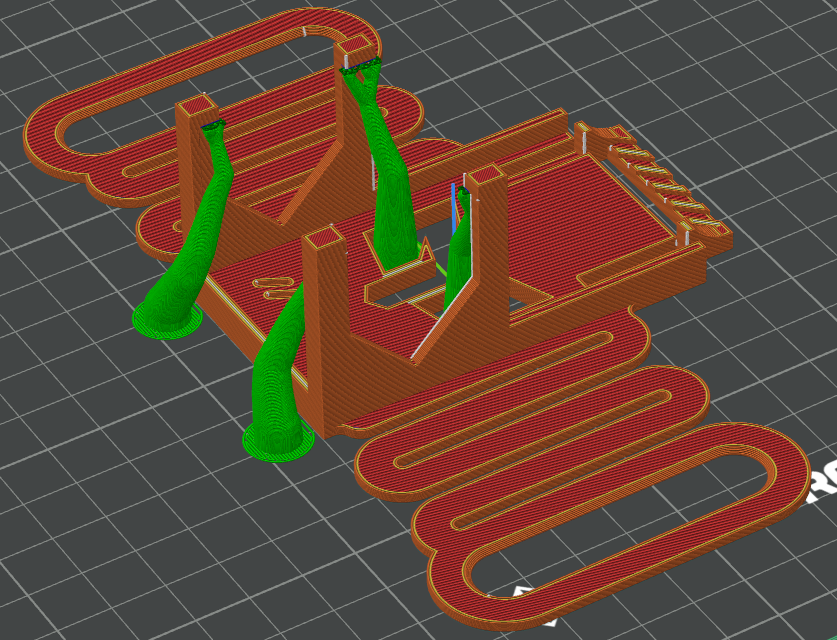

This model was designed with the capabilities of the Flashforge Adventure 5M FDM printer in mind. Printers with similar capabilities will hopefully not experience print issues when it comes to some of the dimensions.

Print Settings Used (OrcaSlicer -- Flashforge Adventure 5M):
- Default settings for PLA (0.20mm Standard @Flashforge AD5M 0.4 Nozzle)
- Strength: sparse infill density: 8%, sparse infill pattern: Triangles
- Support: enable support: true, type: Tree (Manual), on build plate only: true

Place supports as seen below:

  

---

This model is provided as-is, and its suitability for the safety and protection of the parts within is without guarantee. The creator and/or distributors of this model are to be held harmless from any damage, destruction, injury, legal liability, or any other unforeseen consequences resulting from the use of this model and any associated materials or information, either directly or indirectly. This includes all content provided alongside the STL files by the original creator, such as print settings, assembly instructions, and any other provided information. Use this model at your own risk.

---
This model is licensed under CC BY-NC 4.0. See license.txt for details.
